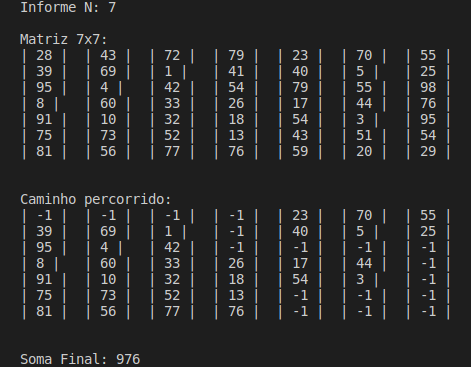

# Contando Instruções

<div style="display: inline-block;">

 
</a> 
</div>

<p> </p>
<p> </p>

## Problema
<p align="justify">
O objetivo desse trabalho é elaborar um programa para caminhar por um conjunto de matrizes N x N, com o valor de N e as matrizes sendo fornecidas como entrada do programa em formato de arquivo, objetivando encontrar o maior valor final seguindo um conjunto de regras preestabelecidas.

1. Criar um sistema que leia K matrizes quadradas no tamanho NxN.
2. Seu programa deve enumerá-las, de forma a deixa-las organizadas para processamento. 
3. Partindo da primeira matriz, você deve iniciar de um ponto preestabelecido, esse pode ser fornecido pelo usuário ou estar contido em arquivos extras de configuração. Não é permitido definir diretamente no código. 
4. A partir da primeira matriz, você tem como regras: 
   - Avançar para a próxima coluna; 
   - Retroceder para coluna anterior; 
   - Saltar para a linha de baixo; 
   - Ir em diagonal para baixo;
   - Observação: Todas essas regras só se aplicam se a casa (posição i,j da matriz) ainda não tenha sido descoberta ou já processada.
5. Para caminhar você deve sempre optar pelo valor da próxima casa, valor esse que deve ser o maior dentre eles. Caso haja empate entre casas, crie uma regra para adotar sempre uma mesma decisão de caminhamento. 
6. Ao alcançar a última linha e coluna da matriz, selecione a próxima matriz e repita todo o processo novamente. Por fim, apresente ao usuário qual foi o caminho adotado e qual a soma obtida do caminho realizado. 
	
</p>

## Beginning
<p align="justify">
Para o desenvolvimento de uma matriz N x N com números inteiros aleatórios de 0 a 99, utilizei o método de ordenção em bolha para criar um loop, então criei os métodos <code>startMatriz</code> para gerar a matriz randômica e <code>printMatriz</code> para imprimi-la.
</p>


```c
void startMatriz(int n, int A[n][n]){
    for(int i = 0; i < n; i++){
        for(int j = 0; j < n; j++){
            A[i][j] = rand()%99;
        }
    }
}
void printMatriz(int n, int A[n][n]){
    for(int i = 0; i < n; i++){
        for(int j = 0; j < n; j++){
            printf("| %d |\t", A[i][j]);
        }
        printf("\n");
    }
}
```

## Brainstorm
<p align="justify">
Para a lógica do contador de instruções precisei organizar um <code>brainstorm</code> buscando analisar as possíveis condições que o programa deveria seguir para se manter dentro das regras prescritas pelo professor.
</p>

```c
// funcao que percorre a matriz e busca o caminho guloso
void caminharMatriz(int **mat, int n, int m){
   
   // inicializa i, j e soma
   int i=0, j=0, sum=0;
   
   // atribui o valor da posicao [0][0] a soma
   sum += mat[0][0];
   
   // atribui -1 ao valor da posição [0][0]
   mat[0][0] = -1;
	
   enquanto (i < quantidade(linhas) e j < quantidade(colunas)){	
 
    se ( linha(i) atual = linha(máxima) ){
        soma recebe valor atual da matriz
        atribui -1 ao valor atual da matriz
        anda coluna
        INSTRUÇÃO --> CAMINHA P/ DIREITA
    }
    senao{
        se ( coluna(j) atual = primeira coluna(j) ){
            se ( (direita >= abaixo) e (direita >= diagonal_direita) ){
                anda coluna
                INSTRUÇÃO --> CAMINHA P/ DIREITA
                soma recebe valor atual da matriz
                atribui -1 ao valor atual da matriz
            }
            senao se ( (abaixo >= direita) e (abaixo >= diagonal_direita) ){
                anda linha
                INSTRUÇÃO --> CAMINHA P/ BAIXO
                soma recebe valor atual da matriz 
                atribui -1 ao valor atual da matriz
            }
            senao ( (diagonal_direita >= abaixo) e (diagonal_direita >= direita) ){
                anda linha
                anda coluna 
                INSTRUÇÃO --> CAMINHA P/ DIAGONAL DIREITA
                soma recebe valor atual da matriz
                atribui -1 ao valor atual da matriz
            }
        }
        senao se ( coluna(j) atual = coluna(máxima) ){
            se ( (abaixo >= esquerda) && (abaixo >= diagonal_esquerda) ){
                anda linha
                INSTRUÇÃO --> CAMINHA P/ BAIXO
                soma recebe valor atual da matriz
                atribui -1 ao valor atual da matriz
            }
            senao se ( (esquerda >= abaixo) && (esquerda >= diagonal_esquerda) ){
                volta coluna
                INSTRUÇÃO --> CAMINHA P/ ESQUERDA
                soma recebe valor atual da matriz
                atribui -1 ao valor atual da matriz
            }
            senao ( (diagonal_esquerda >= abaixo) && (diagonal_esquerda >= esquerda) ){
                volta coluna
                anda linha 
                INSTRUÇÃO --> CAMINHA P/ DIAGONAL ESQUERDA
                soma recebe valor atual da matriz
                atribui -1 ao valor atual da matriz
            }
        }
        senao (caso esteja no meio){   
            se ( (abaixo >= esquerda)  e  (abaixo >= direita)
             e   (abaixo >= diagonal_esquerda) e (abaixo >= diagonal_direita) ){
                anda linha
                INSTRUÇÃO --> CAMINHA P/ BAIXO
                soma recebe valor atual da matriz
                atribui -1 ao valor atual da matriz
            }   
            senao se ( (esquerda >= abaixo) e (esquerda >= direita) 
                   e   (esquerda >= diadonal_esquerda) e (esquerda >= diagonal_direita) ){
                volta coluna
                INSTRUÇÃO --> CAMINHA P/ ESQUERDA
                soma recebe valor atual da matriz
                atribui -1 ao valor atual da matriz
            }
            senao se ( (direita >= abaixo) e (direita >= esquerda) e
               	      e   (direita >= diagonal_esquerda) e (direita >= diagonal_direita) ){
                anda coluna
                INSTRUÇÃO --> CAMINHA P/ DIREITA
                soma recebe valor atual da matriz
                atribui -1 ao valor atual da matriz
            }
            senao se ( (diagonal_esquerda >= diagonal_direita) ){
                volta coluna
                anda linha
                INSTRUÇÃO --> CAMINHA P/ ESQUERDA
                soma recebe valor atual da matriz
                atribui -1 ao valor atual da matriz
            }
            senao ( (diagonal_direita >= diagonal_esquerda) ){
                anda coluna
                anda linha 
                INSTRUÇÃO --> CAMINHA P/ DIAGONAL DIREITA
                soma recebe valor atual da matriz
                atribui -1 ao valor atual da matriz
            }
        }
    }
    se ( (linha(i) = linha(máxima)) e (coluna(j) = coluna(máxima)) ){
        soma recebe valor atual da matriz
        atribui -1 ao valor atual da matriz
        RETORNA o valor total da SOMA
    }
   }
   RETORNA a SOMA total para a função
}
```

## Método de Contar Instruções

<p align="justify">
Partindo do apresentado, busquei criar um loop que trabalha até chegar ao último termo da matriz N x N. Além disso, apliquei as ideias do <code>brainstorm</code>, implementando as condições previstas, ajustando para que o valor da soma fosse guardado e criando um método para atribuir o <code>-1</code> ao valor das posições NxN após serem percorridas, de acordo com as regras do programa, a fim de marcar o caminho percorrido na matriz.
</p>

```c
//funcao que percorrera a matriz e contara as instrucoes
int instructCounter(int n, int A[n][n]){
    int sum, i = 0, j = 0;
    sum = A[0][0]; //starta a soma na posição [0][0]
    A[0][0] = -1; //atribui -1 ao valor da posição [0][0]
    //loop enquanto i e j < n
    while(i < n && j < n){
        //*condicao 1*
        if(j == 0 && i < (n-1)){
            //*condicao 1.1*
            if((A[i][j+1] >= A[i+1][j]) && (A[i][j+1] != -1)){
                j++; //j+1
                sum += A[i][j]; //soma = soma + valor escolhido de A[i][j]
                A[i][j] = -1; //atribui -1 a posicao escolhida
                //*condicao 1.1*/ escolho: DIREITA /
            }
            //*condicao 1.2*
            else{
                i++;
                sum += A[i][j]; 
                A[i][j] = -1; 
                //*condicao 1.2*/ escolho: ABAIXO / 
            }
        }
        //*condicao 2*
        else if(i == (n-1)){
            j++;
            sum += A[i][j];
            A[i][j] = -1;
            //*condicao 2*/ DIREITA /
        }
        //*condicao 3*
        else if(j == n-1){
            //*condicao 3.1*/ escolho: ESQUERDA /
            if((A[i][j-1] >= A[i+1][j]) && (A[i][j-1] != -1)){
                j--;
                sum += A[i][j];
                A[i][j] = -1;
            }
            //*condicao 3.2*/ escolho: ABAIXO /
            else{
                i++;
                sum += A[i][j];
                A[i][j] = -1;
            }
        }
        //*condicao 4*
        else{
            //*condicao 4.1*
            if(A[i][j+1] == -1){
                //*condicao 4.1.1*/ escolho: ABAIXO /
                if(A[i+1][j] >= A[i][j-1]){
                    i++; 
                    sum += A[i][j];
                    A[i][j] = -1; 
                }
                //*condicao 4.1.2*/ escolho: ESQUERDA / 
                else{
                    j--;
                    sum += A[i][j];
                    A[i][j] = -1;
                }
            }
            //*condicao 4.2*
            else if(A[i][j-1] == -1){
                //*condicao 4.2.1*/ escolho ABAIXO/
                if(A[i+1][j] >= A[i][j+1]){
                    i++;
                    sum += A[i][j];
                    A[i][j] = -1;
                }
                //*condicao 4.2.2*/ escolho: DIREITA /
                else{
                    j++;
                    sum += A[i][j];
                    A[i][j] = -1;
                }
            }
            //*condicao 4.3*
            else{
                //*condicao 4.3.1*/ escolho: ABAIXO/
                if((A[i+1][j] >=  A[i][j+1]) && (A[i+1][j] >= A[i][j-1])){
                    i++;
                    sum += A[i][j];
                    A[i][j] = -1;
                }
                //*condicao 4.3.2*/ escolho: DIREITA /
                else if((A[i][j+1] >= A[i+1][j]) && (A[i][j+1] >= A[i][j-1])){
                    j++;
                    sum += A[i][j];
                    A[i][j] = -1;
                }
                //*condicao 4.3.3*/ escolho: ESQUERDA /
                else if((A[i][j-1] >= A[i+1][j]) && (A[i][j-1] >= A[i][j+1])){
                    j--;
                    sum += A[i][j];
                    A[i][j] = -1;
                }
            }
        }
    }
    return sum; //retorna o valor final da soma
}
```
## Testando
<p align="justify">
	Criando um exemplo de teste para o método <code>instructCounter</code> para uma matriz com N = 7.
</p>

<p align="center">
	 
</p>

<p align="center">
	28 + 43 + 72 + 79 + 41 + 54 + 79 + 55 + 98 + 76 + 95 + 54 + 51 + 43 + 59 + 20 + 29 = 976
</p>


<!--
## Questionamentos Finais
</p>
1) - Há mais de uma maneira de resolver esse problema ?
</p>
<p align="justify">
Acredito que hajam diversas maneiras para a resolução do problema proposto e possivelmente uma diminuição do custo computacional gerado, porém a maneira apresentada foi a única que consegui implementar.
</p>
2) - Há algoritmos em literatura que resolvam esse problema ?
</p>
<p align="justify">
Presumo que dentro do conteúdo de estrutura de dados há um meio para armazenar e organizar dados com maior facilidade ao acesso e às modificações.
</p>
3) - Pode existir mais de um caminho cujo valor total é o maximo?
</p>
<p align="justify">
Pelo que pude notar sim, uma vez que o caminho seguido pelo programa, através da regra definida previamente pelo professor, mostra que nem sempre ocorre a escolha dos maiores valores dentro da matriz, quando na verdade o algoritmo escolhe os maiores valores "próximos" ao valor escolhido anteriormente, podendo estes serem variados devido ao fator randômico da matriz, e nem sempre os maiores possiveis dentro de toda a matriz gerada.
</p>
-->

# Compilação e Execução

Esse pequeno exemplo possui um arquivo Makefile que realiza todo o procedimento de compilação e execução. Para tanto, temos as seguintes diretrizes de execução:


| Comando                |  Função                                                                                           |                     
| -----------------------| ------------------------------------------------------------------------------------------------- |
|  `make clean`          | Apaga a última compilação realizada contida na pasta build                                        |
|  `make`                | Executa a compilação do programa utilizando o gcc, e o resultado vai para a pasta build           |
|  `make run`            | Executa o programa da pasta build após a realização da compilação                                 |
|  `make r`              | Apaga a últimca compilação, Executa a compilação e logo após Executa o programa da basta build    |

# Contatos

<div style="display: inline-block;">
<a href="">
 
</a>

</div>
