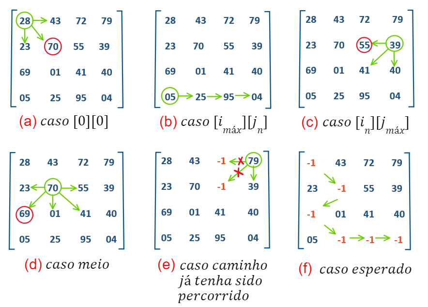
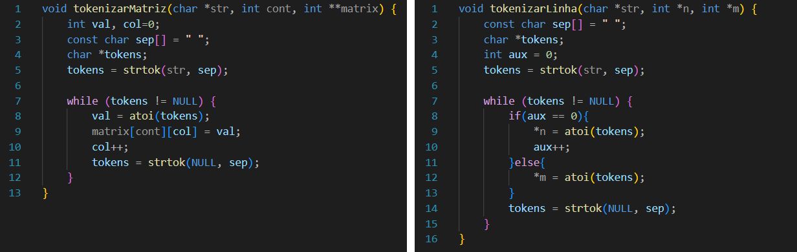
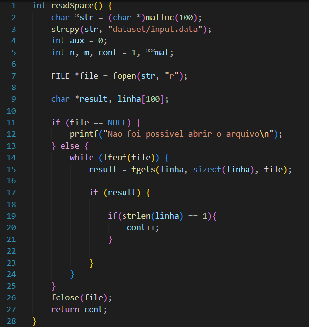
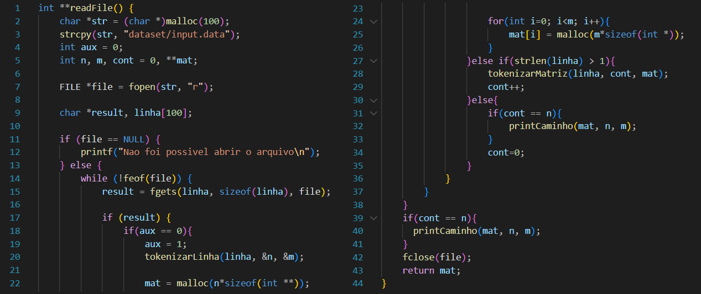

# Caminho Guloso

<div style="display: inline_block">
  
  
  
</div><br/>

<p> </p>
<p> </p>

## Apresentação do Problema
<p align="justify">
O objetivo desse trabalho é elaborar um programa para caminhar por um conjunto de matrizes N x N, com o valor de N e as matrizes sendo fornecidas como entrada do programa em formato de arquivo, objetivando encontrar o maior valor final seguindo um conjunto de regras preestabelecidas.
</p>


<p align="justify">
	1️⃣ Criar um sistema que leia K matrizes quadradas no tamanho NxN.
</p>
<p align="justify">
	2️⃣ Seu programa deve enumerá-las, de forma a deixa-las organizadas para processamento.
</p>
<p align="justify">
	3️⃣ Partindo da primeira matriz, você deve iniciar de um ponto preestabelecido, esse pode ser fornecido pelo usuário ou estar contido em arquivos extras de 		configuração. Não é permitido definir diretamente no código.
</p>	
<p align="justify">
	4️⃣ A partir da primeira matriz, você tem como regras:
	
	➡️ Avançar para a próxima coluna;
	⬅️ Retroceder para coluna anterior;
	⬇️ Saltar para a linha de baixo;
	↙️ Ir em diagonal para baixo; ↘️
	⚠️ Observação: Todas essas regras só se aplicam se a casa (posição [i][j] da matriz) ainda não tenha sido percorrida.
</p>
<p align="justify">
	5️⃣ Para caminhar você deve sempre optar pelo valor da próxima casa, valor esse que deve ser o maior dentre eles. Caso haja empate entre casas, crie uma regra 		para adotar sempre uma mesma decisão de caminhamento.
</p>
<p align="justify">
	6️⃣ Ao alcançar a última linha e coluna da matriz, selecione a próxima matriz e repita todo o processo novamente. Por fim, apresente ao usuário qual foi o 		caminho adotado e qual a soma obtida do caminho realizado	
</p>

## O que seria "Caminho Guloso"?
<p align="justify">
O conceito por trás da expressão em destaque gira em torno de percorrer uma matriz de NxN elementos, de forma que caminhemos ao longo da matriz escolhendo os maiores valores possíveis contidos nela, evitando passar por valores já percorridos e voltar linhas, ou seja, subir não é uma opção. Caso não tenha ficado claro, basta observar as imagens abaixo a fim de se orientar.
</p>

<p align="center">
	 
</p>

## Lógica Utilizada
<p align="justify">
A lógica utilizada de percorrer o caminho seguindo as regras apresentadas pelo professor consistiu em 3 condições maiores e diversas sub-condições dentro delas. Foi necessário organizar um tipo de <code>brainstorm</code> buscando analisar as possíveis condições que o programa deveria seguir para se manter dentro do caminho esperado, assim foi pensado no seguinte esquema:
</p>

<!--
- [x] Avançar para a próxima coluna; 
- [x] Retroceder para coluna anterior; 
- [x] Saltar para a linha de baixo; 
- [x] Ir em diagonal para baixo;
- [x] Percorrer determinada posição apenas uma vez;
-->

```c
// funcao que percorre a matriz e busca o caminho guloso
função caminharMatriz(){
   
   // inicializa i, j e soma
   int i=0, j=0, sum=0;
   
   // atribui o valor da posicao [0][0] a soma
   sum += mat[0][0];
   
   // atribui -1 ao valor da posição [0][0]
   mat[0][0] = -1;
	
   enquanto (i < quantidade(linhas) e j < quantidade(colunas)){	
    // CONDIÇÃO 1
    se ( linha(i) atual = linha(máxima) ){
        soma recebe valor atual da matriz
        atribui -1 ao valor atual da matriz
        anda coluna
        INSTRUÇÃO --> CAMINHA P/ DIREITA ➡️
    }
    // CONDIÇÃO 2
    senao se{
    	// condição 2.1
        se ( coluna(j) atual = primeira coluna(j) ){
            // condição 2.1.1
            se ( (direita >= abaixo) e (direita >= diagonal_direita) ){
                anda coluna
                INSTRUÇÃO --> CAMINHA P/ DIREITA ➡️
                soma recebe valor atual da matriz
                atribui -1 ao valor atual da matriz
            }
            // condição 2.1.2
            senao se ( (abaixo >= direita) e (abaixo >= diagonal_direita) ){
                anda linha
                INSTRUÇÃO --> CAMINHA P/ BAIXO ⬇️
                soma recebe valor atual da matriz 
                atribui -1 ao valor atual da matriz
            }
            // condição 2.1.3
            senao ( (diagonal_direita >= abaixo) e (diagonal_direita >= direita) ){
                anda linha
                anda coluna 
                INSTRUÇÃO --> CAMINHA P/ DIAGONAL DIREITA ↘️
                soma recebe valor atual da matriz
                atribui -1 ao valor atual da matriz
            }
        }
        // condição 2.2
        senao se ( coluna(j) atual = coluna(máxima) ){
            // condição 2.2.1
            se ( (abaixo >= esquerda) && (abaixo >= diagonal_esquerda) ){
                anda linha
                INSTRUÇÃO --> CAMINHA P/ BAIXO ⬇️
                soma recebe valor atual da matriz
                atribui -1 ao valor atual da matriz
            }
            // condição 2.2.2
            senao se ( (esquerda >= abaixo) && (esquerda >= diagonal_esquerda) ){
                volta coluna
                INSTRUÇÃO --> CAMINHA P/ ESQUERDA ⬅️
                soma recebe valor atual da matriz
                atribui -1 ao valor atual da matriz
            }
            // condição 2.2.3
            senao ( (diagonal_esquerda >= abaixo) && (diagonal_esquerda >= esquerda) ){
                volta coluna
                anda linha 
                INSTRUÇÃO --> CAMINHA P/ DIAGONAL ESQUERDA ↙️
                soma recebe valor atual da matriz
                atribui -1 ao valor atual da matriz
            }
        }
        // condição 2.3
        senao (caso geral){   
            // condição 2.3.1
            se ( (abaixo >= esquerda)  e  (abaixo >= direita)
             e   (abaixo >= diagonal_esquerda) e (abaixo >= diagonal_direita) ){
                anda linha
                INSTRUÇÃO --> CAMINHA P/ BAIXO ⬇️
                soma recebe valor atual da matriz
                atribui -1 ao valor atual da matriz
            }   
            // condição 2.3.2
            senao se ( (esquerda >= abaixo) e (esquerda >= direita) 
                   e   (esquerda >= diadonal_esquerda) e (esquerda >= diagonal_direita) ){
                volta coluna
                INSTRUÇÃO --> CAMINHA P/ ESQUERDA ⬅️
                soma recebe valor atual da matriz
                atribui -1 ao valor atual da matriz
            }
            // condição 2.3.3
            senao se ( (direita >= abaixo) e (direita >= esquerda) e
               	      e   (direita >= diagonal_esquerda) e (direita >= diagonal_direita) ){
                anda coluna
                INSTRUÇÃO --> CAMINHA P/ DIREITA ➡️
                soma recebe valor atual da matriz
                atribui -1 ao valor atual da matriz
            }
            // condição 2.3.4
            senao se ( (diagonal_esquerda >= diagonal_direita) ){
                volta coluna
                anda linha
                INSTRUÇÃO --> CAMINHA P/ ESQUERDA ⬅️
                soma recebe valor atual da matriz
                atribui -1 ao valor atual da matriz
            }
            // condição 2.3.5
            senao ( (diagonal_direita >= diagonal_esquerda) ){
                anda coluna
                anda linha 
                INSTRUÇÃO --> CAMINHA P/ DIAGONAL DIREITA ↘️
                soma recebe valor atual da matriz
                atribui -1 ao valor atual da matriz
            }
        }
    }
    // CONDIÇÃO 3
    se ( (linha(i) = linha(máxima)) e (coluna(j) = coluna(máxima)) ){
        soma recebe valor atual da matriz
        atribui -1 ao valor atual da matriz
        RETORNA o valor total da SOMA
    }
   }
   RETORNA a SOMA total para a função
}
```

## Solução do Problema

<p align="justify">
Partindo do apresentado como problema, a ideia principal para solução gira em torno do tratamento de arquivos. Desse modo, primeiramente criou-se o método <code>tokenizarLinha</code> que trabalha fazendo a leitura da primeira linha apresentada no arquivo, a qual representa o tamanho NxN das matrizes geradas e que será usada ao decorrer do programa para o tratamento do tamanho das matrizes. Logo em seguida gerou-se o método <code>tokenizarMatriz</code> a fim de tokenizar as matrizes geradas no arquivo.
</p>
<p align="center">
	 
</p>

<p align="justify">
A frente, dando sequência ao tratamento de arquivo foi criado o método <code>readSpace</code> ao qual de fato faz a leitura do arquivo e conta os espaços em branco entre as matrizes a fim de demarcá-las e separá-las a fim de serem passadas para o método <code>caminharMatriz</code> que fará todo o processo percorrendo a matriz conforme as regras previamente expostas.
</p>
<p align="center">
	 
</p>

<p align="justify">
Adiante foi criado um método <code>readFile</code> ao qual de fato faz a leitura do arquivo implementando os métodos <code>tokenizarLinha</code> e <code>tokenizarMatriz</code>.
</p>
<p align="center">
	 
</p>

<p align="justify">
Além disso, apliquei as ideias do <code>brainstorm</code>, implementando as condições previstas na função <code>caminharMatriz()</code>, ajustando para que o valor da soma fosse guardado e criando um método para atribuir o <code>-1</code> ao valor das posições <code>[i][j]</code> após serem percorridas, de acordo com as regras do programa, a fim de marcar o caminho percorrido na matriz.
</p>

```c

```
## Testes de execução
<p align="justify">
	Criando um exemplo de teste da aplicação para uma matriz com 4x4, contendo 3 matrizes no arquivo que será lido.
</p>

<p align="center">
	 
</p>

<!--
## Questionamentos Finais
</p>
1) - Há mais de uma maneira de resolver esse problema ?
</p>
<p align="justify">
Acredito que hajam diversas maneiras para a resolução do problema proposto e possivelmente uma diminuição do custo computacional gerado, porém a maneira apresentada foi a única que consegui implementar.
</p>
2) - Há algoritmos em literatura que resolvam esse problema ?
</p>
<p align="justify">
Presumo que dentro do conteúdo de estrutura de dados há um meio para armazenar e organizar dados com maior facilidade ao acesso e às modificações.
</p>
3) - Pode existir mais de um caminho cujo valor total é o maximo?
</p>
<p align="justify">
Pelo que pude notar sim, uma vez que o caminho seguido pelo programa, através da regra definida previamente pelo professor, mostra que nem sempre ocorre a escolha dos maiores valores dentro da matriz, quando na verdade o algoritmo escolhe os maiores valores "próximos" ao valor escolhido anteriormente, podendo estes serem variados devido ao fator randômico da matriz, e nem sempre os maiores possiveis dentro de toda a matriz gerada.
</p>
-->

## Compilação e Execução

Esse pequeno exemplo possui um arquivo Makefile que realiza todo o procedimento de compilação e execução. Para tanto, temos as seguintes diretrizes de execução:


| Comando                |  Função                                                                                               |                     
| -----------------------| ------------------------------------------------------------------------------------------------------|
|  `make clean`          | Apaga a última compilação realizada contida na pasta build                                            |
|  `make`                | Executa a compilação do programa utilizando o gcc, e o resultado vai para a pasta build               |
|  `make run`            | Executa o programa da pasta build após a realização da compilação                                     |

## Contatos

<div style="display: inline-block;">
<a href="https://t.me/celso_vsf">
 
</a>

</div>
